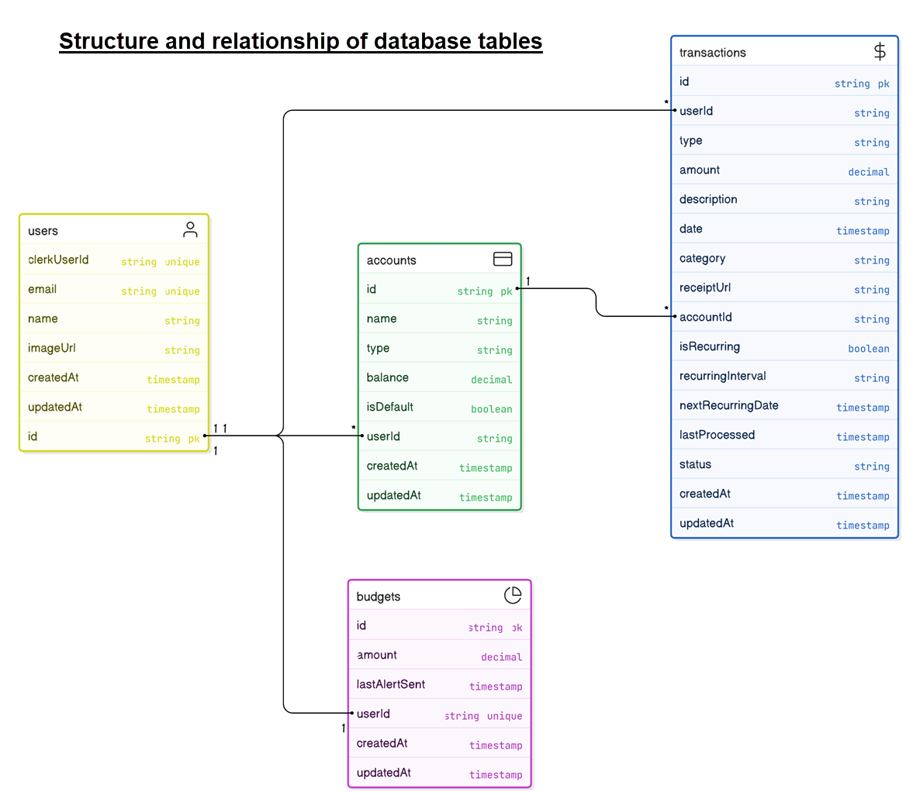

# AI Fianace Platform 

## Overview

An AI-powered financial management platform that helps you track, analyze, and optimize your spending with real-time insights
It leverages cutting-edge technologies like React, Next.js, and Artificial Intelligence to provide a user-friendly and comprehensive financial tool.

[Site](https://ai-finance-platform.vercel.app/)

## Target Audience

This platform is targeted towards individual users to let them act with greater confidence. It caters to users with varying levels of experience, offering valuable guidance and analytical tools.

## Benefits

* **AI-powered Insights:** Gain valuable insights and recommendations based on AI analysis of the financial data.
* **Data-driven Decision Making:** Make informed investment choices backed by a robust platform that prioritizes data visualization and clear information.
* **User-friendly Interface:** Experience a smooth and intuitive interface designed to simplify complex financial concepts and streamline investment processes.
* **Secure and Reliable:** The platform prioritizes security with features like Clerk authentication and ArcJet for enhanced protection.


---

 

---

## Core Functionality

*The AI Finance Platform offers a range of functionalities to support your investment journey*:

* **User Authentication:** Securely create an account and manage your profile information.
* **Investment Analysis:** Utilize AI-powered tools to analyze market trends and identify potential investment opportunities.
* **Data Visualization:** Gain insights from interactive charts and graphs that represent financial data.
* **Portfolio Management:** Track your investments and monitor performance over time. 


## Tech Stack

**Frontend (Client-Side):**

* **Next.js 15:** Provides a robust and performant foundation for the user interface.
* **Tailwind CSS & Shadcn UI:** Enables the creation of a visually appealing and responsive user interface.
* **Clerk:** Simplifies user authentication and authorization processes.
* **ArcJet:** Offers a comprehensive security suite including bot detection, rate limiting, and data redaction.
* **Inngest:** Provides a powerful platform for building scalable backend systems with efficient task management.
* **Resend:** Deliver transactional and marketing emails at scale.
* **Zod, Rechart, date-fns:** Enhances the platform with data validation, data visualization capabilities, and effective date/time manipulation.


**Backend (Server-Side):**


* **Supabase & PostgreSQL:** Leverages Supabase, an open-source Firebase alternative, alongside PostgreSQL for robust database management.
* **Prisma:** Streamlines data access and interaction with the PostgreSQL database.


 

**Configuration:**  *Make sure to create a `.env` file with following variables*

```js
DATABASE_URL=
DIRECT_URL=

NEXT_PUBLIC_CLERK_PUBLISHABLE_KEY=
CLERK_SECRET_KEY=
NEXT_PUBLIC_CLERK_SIGN_IN_URL=/sign-in
NEXT_PUBLIC_CLERK_SIGN_UP_URL=/sign-up
NEXT_PUBLIC_CLERK_AFTER_SIGN_IN_URL=/onboarding
NEXT_PUBLIC_CLERK_AFTER_SIGN_UP_URL=/onboarding

GEMINI_API_KEY=

RESEND_API_KEY=

ARCJET_KEY=
```

## Getting Started

1. Visit the AI Finance Platform website: [Site](https://ai-finance-platform.vercel.app/)
2. Create an account using the secure sign-up process.
3. Explore the platform's features and functionalities to familiarize yourself with its offerings.


##### Contact:

[][linkedin]

[linkedin]: https://www.linkedin.com/in/sergiy-antonyuk/


## Acknowledgements

A special thanks to [you](https://www.youtube.com/@GreatStackDev) for your invaluable contributions and inspiration.
